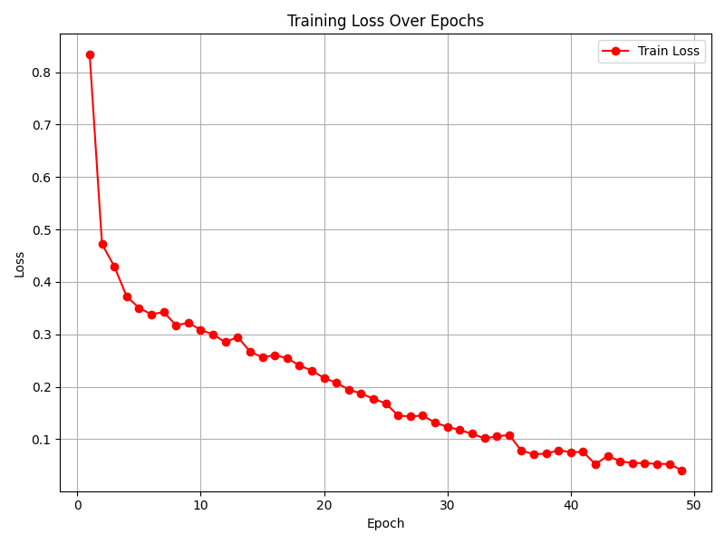
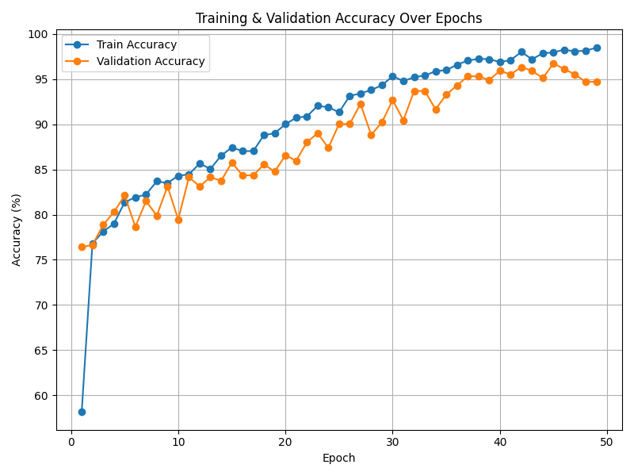

# 📈 Driver Drowsiness Detection (PyTorch + GPU)  
[](https://www.python.org/)  
[](https://pytorch.org/)  
[](https://opencv.org/)  
[](LICENSE)  
[]()  

A **real-time driver monitoring system** using **PyTorch** that detects drowsiness by analyzing eye states through a webcam.  
If the driver’s eyes remain closed beyond a threshold, the system triggers an **audible alarm** to prevent potential accidents.

---

## 📊 Model Performance
Evaluated on the test set:
```
Device: CUDA (GPU)
Test Loss: 0.1018
Test Accuracy: 96.77%
```

---

## 📂 Project Structure
```
Driver_Drowsiness_Detection/
├── dataset_new/               # Dataset (train/valid/test) - ignored in Git
├── env/                       # Virtual environment - ignored in Git
├── haar_cascade_files/        # Haar XML files for face & eye detection
├── models/                    # Trained PyTorch models (.pth)
├── alarm.wav                  # Alarm sound file
├── check_model_status.py      # Quick evaluation & accuracy check
├── main.py                    # Real-time detection script
├── model.py                   # Model architecture
├── plot_results.py            # Plot training metrics
├── setup.py                   # Training & setup script
├── visualize_predictions.py   # View predictions on test data
├── training_loss_graph.png    # Training loss graph (kept in Git)
├── training_accuracy_graph.png# Training accuracy graph (kept in Git)
├── README.md                  # Documentation
└── .gitignore                 # Ignored files/folders
```

## 🚀 Getting Started

### 1️⃣ Clone the Repository
```bash
git clone https://github.com/rishithayanidhi/Driver_Drowsiness_Detection.git
cd Driver_Drowsiness_Detection
```

### 2️⃣ Create & Activate a Virtual Environment
**Windows**
```bash
python -m venv env
.\env\Scripts\activate
```
**macOS / Linux**
```bash
python -m venv env
source env/bin/activate
```

### 3️⃣ Install Dependencies
For **GPU**:
```bash
pip install torch torchvision torchaudio --index-url https://download.pytorch.org/whl/cu118
pip install opencv-python==4.6.0.66 numpy==1.23.0 pygame==2.4.0
```
For **CPU**:
```bash
pip install torch torchvision torchaudio
pip install opencv-python==4.6.0.66 numpy==1.23.0 pygame==2.4.0
```

### 4️⃣ Train the Model
```bash
python model.py
```
- Loads and preprocesses the dataset.
- Trains the CNN model for driver drowsiness detection.

---

### 4️⃣ Run the Application
```bash
python main.py
```
- Webcam will activate.
- Alarm triggers if drowsiness is detected.

---

## 📊 Training Statistics

| Validation Loss | Validation Accuracy |
|-----------------|---------------------|
|  |  |

---

## 📦 Dataset
- Contains **open** and **closed** eye images.
- Downloaded from **Kaggle**.
- Stored locally in:
```
dataset_new/
├── train/
├── valid/
└── test/
```
- Ignored in GitHub for size and privacy.

---

## ⚙️ Configuration
Edit `main.py` to adjust:
```python
MODEL_PATH = "models/drowsiness_model.pth"
ALARM_SOUND = "alarm.wav"
DROWSINESS_THRESHOLD = 0.5
FRAME_WIDTH = 640
FRAME_HEIGHT = 480
```

---

## 🎯 Advanced Usage

### Automatic Project Setup
```bash
python setup.py
```
- Creates a virtual environment.
- Installs all defined dependencies from the setup.py file.

### Test the Model
```bash
python check_model_status.py
```
Example output:
```
Using device: cuda
📊 Test Loss: 0.1018
✅ Test Accuracy: 96.77%
```

### Visualize Predictions
```bash
python visualize_predictions.py
```
Displays model predictions for sample test images.

---

## 📜 Notes
- Requires **Python 3.8+**.
- CUDA-enabled GPU recommended for training & real-time inference.
- `.gitignore` ensures datasets, models, and other large files are not pushed to GitHub.

---
